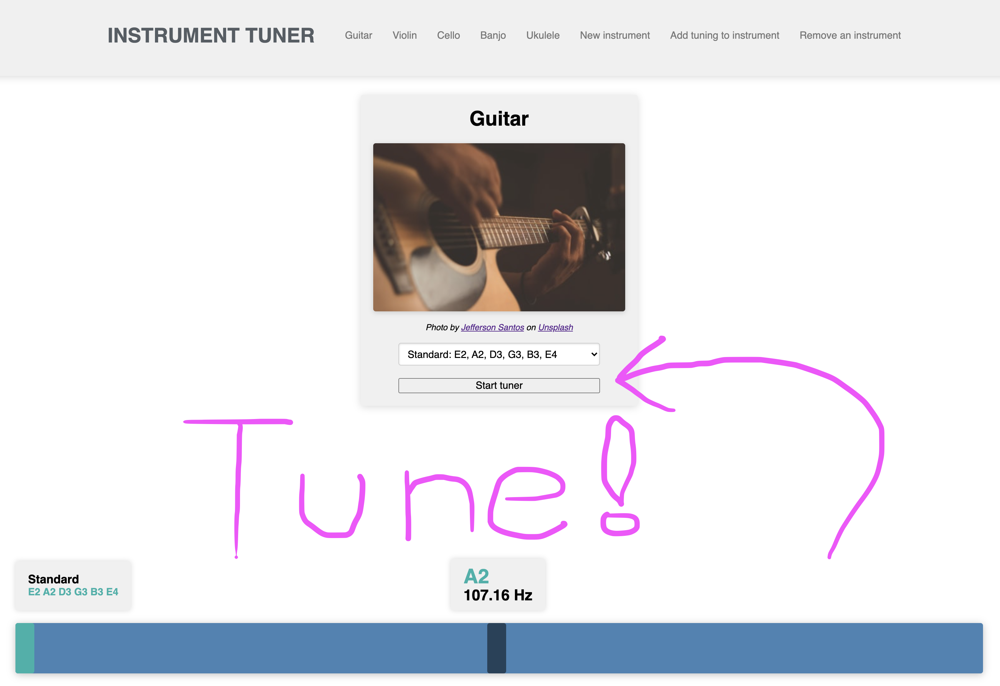

# Instrument Tuner (Frontend)

The frontend component of a customizable instrument tuner webapp

## Installation
To run the app, you will need [the backend component of this project](https://github.com/ghemsley/instrument-tuner-backend) as well. Refer to that repository's readme for instructions.

After that is setup properly and the rails server is running, you should just be able to clone the repo and open `index.html` in the `dist` folder in a browser.

If you want to make changes, first you'll need NodeJS and Yarn installed.
After those are setup, run `yarn install` to grab the dependencies.
Then you should be able to open a console and do `yarn run webpack` to compile the bundle.
After that, changes should be reflected when you open `index.html` from the `dist` folder in a browser.

## Usage

The backend includes seed code for a Guitar and a Violin instrument already.
To tune one of those instruments, run the project then navigate to the instrument's page and hit the submit button on one of the included tunings.
You can also add tunings to those instruments if you want. Make sure that the notes include the corresponding octave and are comma separated.

For example, to add a standard 6 string guitar tuning, the form submission should have the string `E2, A2, D3, G3, B3, E4` in the `Tuning notes (comma separated)` field.

To add a new instrument, navigate to the `New instrument` page and give the instrument a name, then add one or more tunings and hit submit. An image will automatically be pulled from Unsplash for your instrument.

Afterwards, the page will refresh and you can navigate to the instrument page you just created using the navbar and hit submit on your preferred tuning to begin tuning your instrument.

When the tuner is activated, it will ask for permission to use an audio input device. Make sure you accept that request and choose an input device that has the least static and background noise. If the tuner doesn't seem to be working right, try to reduce background noise or increase the volume of your input device in your sound control panel.

## Contributing

Bug reports and pull requests are welcome on GitHub at https://github.com/ghemsley/

## License

[MIT License](./LICENSE)
